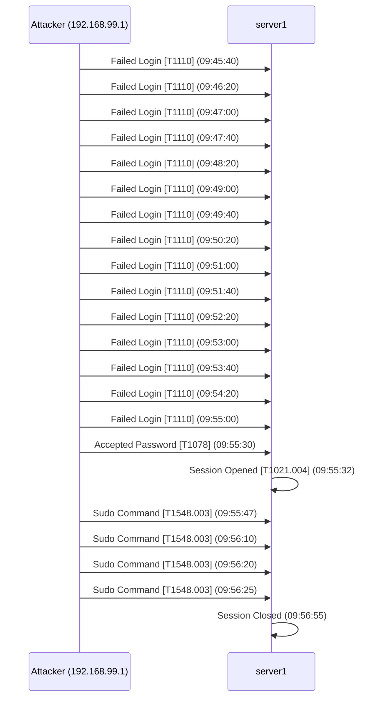

# Sample Report

This is real output from `ais analyze` run against a synthetic lab log generated by `ais demo`.
The log simulates a complete SSH brute-force → credential stuffing → post-exploitation attack chain.

```bash
ais demo  # or: ais analyze logs/lab_attack.log --fmt auth_log
```

---

# Cyber Incident Report

*Generated: 2026-04-25 00:02 UTC*

## Executive Summary (BLUF)

Analysis of **23** log events identified **1 attacking IP(s)**.
**1 attacker(s) achieved successful authentication**, potentially compromising account(s): `root`.
Maximum incident severity: **CRITICAL**.

## Attack Timeline

| UTC Time | Attacker IP | User | Event | MITRE | Severity |
|----------|-------------|------|-------|-------|----------|
| 09:45:40 | 192.168.99.1 | `root` | Failed Login | `T1110` Brute Force | medium |
| 09:46:20 | 192.168.99.1 | `root` | Failed Login | `T1110` Brute Force | medium |
| 09:47:00 | 192.168.99.1 | `root` | Failed Login | `T1110` Brute Force | medium |
| 09:47:40 | 192.168.99.1 | `root` | Failed Login | `T1110` Brute Force | medium |
| 09:48:20 | 192.168.99.1 | `root` | Failed Login | `T1110` Brute Force | medium |
| 09:49:00 | 192.168.99.1 | `root` | Failed Login | `T1110` Brute Force | medium |
| 09:49:40 | 192.168.99.1 | `root` | Failed Login | `T1110` Brute Force | medium |
| 09:50:20 | 192.168.99.1 | `root` | Failed Login | `T1110` Brute Force | medium |
| 09:51:00 | 192.168.99.1 | `root` | Failed Login | `T1110` Brute Force | medium |
| 09:51:40 | 192.168.99.1 | `root` | Failed Login | `T1110` Brute Force | medium |
| 09:52:20 | 192.168.99.1 | `root` | Failed Login | `T1110` Brute Force | medium |
| 09:53:00 | 192.168.99.1 | `root` | Failed Login | `T1110` Brute Force | medium |
| 09:53:40 | 192.168.99.1 | `root` | Failed Login | `T1110` Brute Force | medium |
| 09:54:20 | 192.168.99.1 | `root` | Failed Login | `T1110` Brute Force | medium |
| 09:55:00 | 192.168.99.1 | `root` | Failed Login | `T1110` Brute Force | medium |
| 09:55:30 | 192.168.99.1 | `admin` | Accepted Password | `T1078` Valid Accounts | critical |
| 09:55:32 | 192.168.99.1 | `admin` | Session Opened | `T1021.004` Remote Services: SSH | info |
| 09:55:47 | 192.168.99.1 | `admin` | Sudo Command | `T1548.003` Abuse Elevation Control: Sudo | high |
| 09:56:10 | 192.168.99.1 | `admin` | Sudo Command | `T1548.003` Abuse Elevation Control: Sudo | high |
| 09:56:20 | 192.168.99.1 | `admin` | Sudo Command | `T1548.003` Abuse Elevation Control: Sudo | high |
| 09:56:25 | 192.168.99.1 | `admin` | Sudo Command | `T1548.003` Abuse Elevation Control: Sudo | high |
| 09:56:55 | 192.168.99.1 | `admin` | Session Closed | — | info |

## Visual Sequence Map



## Threat Actor Detail

### `192.168.99.1` — CRITICAL
- **Chain type**: Post Exploitation
- **Compromised**: Yes [!]
- **Primary target account**: `root`
- **Attack progression**: `T1110` -> `T1078` -> `T1021.004` -> `T1548.003`
- **Events in chain**: 22
- **Active window**: 09:45:40 -> 09:56:55

## Recommendations

1. Immediately audit and rotate credentials for all compromised accounts.
2. Review sudo logs and session commands for post-exploitation activity (file downloads,
   persistence mechanisms, privilege escalation).
3. Audit sudo policy — restrict to minimum required privileges (principle of least
   privilege).
4. Disable direct root SSH login: set `PermitRootLogin no` in sshd_config.
5. Enable fail2ban or equivalent rate-limiting to automatically throttle repeated
   authentication failures.

## Forensic Integrity

| Source Log | Events Analyzed |
|-----------|----------------|
| `lab_attack.log` | 23 |

> Original log files are opened read-only and never modified. SHA-256 hashes are stored in `data/processed/` for chain-of-custody verification.
