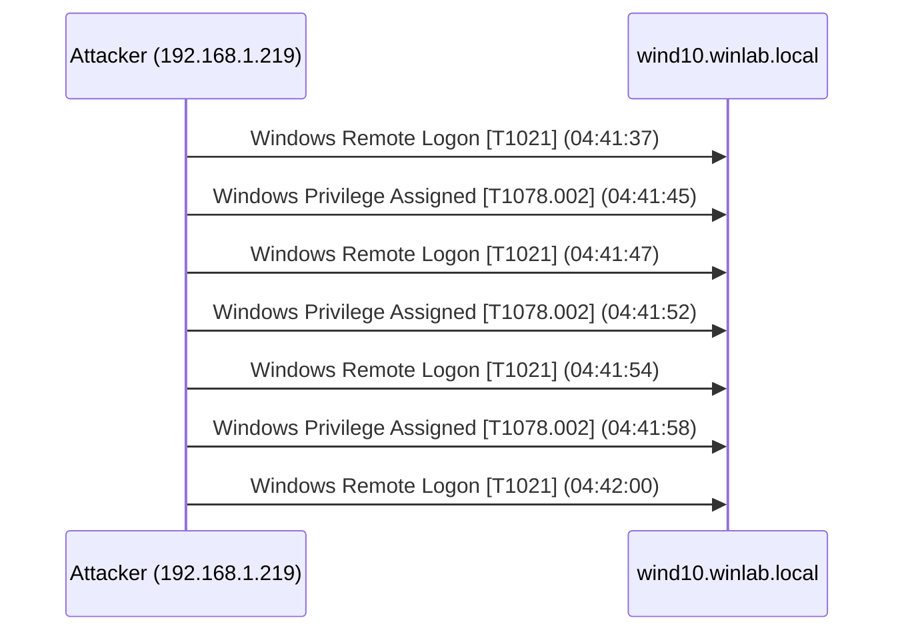

# Sample Report

Real output from `ais analyze` run against a captured Windows Security Event Log from
[sbousseaden/EVTX-ATTACK-SAMPLES](https://github.com/sbousseaden/EVTX-ATTACK-SAMPLES).
The log captures an **NTLM self-relay privilege escalation** — the attacker relays their
own NTLM authentication to the local SMB service, obtaining an `Administrator` session
with no prior failed logins. This is the silent-access detection pathway in action:
the tool flags a compromise that would be invisible to any threshold-based brute-force detector.

```bash
ais analyze NTLM2SelfRelay-med0x2e-security_4624_4688.evtx --fmt evtx --output incident.md
```

Note the **unauthorized_access / Compromised: Yes** result with **zero failed logins** —
the tool detected a silent NTLM relay entirely through Pass 2 (success-only logon detection).

---

# Cyber Incident Report

*Generated: 2026-04-25 20:54 UTC*

## Executive Summary (BLUF)

Analysis of **9** log events identified **1 attacking IP(s)**.
**1 attacker(s) achieved successful authentication**, potentially compromising account(s): `Administrator`.
Maximum incident severity: **MEDIUM**.

## Attack Timeline

| UTC Time | Attacker IP | User | Event | MITRE | Severity |
|----------|-------------|------|-------|-------|----------|
| 04:41:37 | 192.168.1.219 | `Administrator` | Windows Remote Logon | `T1021` Remote Services | info |
| 04:41:45 | 192.168.1.219 | `Administrator` | Windows Privilege Assigned | `T1078.002` Valid Accounts: Domain Accounts | medium |
| 04:41:47 | 192.168.1.219 | `Administrator` | Windows Remote Logon | `T1021` Remote Services | info |
| 04:41:52 | 192.168.1.219 | `Administrator` | Windows Privilege Assigned | `T1078.002` Valid Accounts: Domain Accounts | medium |
| 04:41:54 | 192.168.1.219 | `Administrator` | Windows Remote Logon | `T1021` Remote Services | info |
| 04:41:58 | 192.168.1.219 | `Administrator` | Windows Privilege Assigned | `T1078.002` Valid Accounts: Domain Accounts | medium |
| 04:42:00 | 192.168.1.219 | `Administrator` | Windows Remote Logon | `T1021` Remote Services | info |

## Visual Sequence Map



## Threat Actor Detail

### `192.168.1.219` — MEDIUM
- **Chain type**: Unauthorized Access
- **Compromised**: Yes [!]
- **Primary target account**: `Administrator`
- **Attack progression**: `T1021` -> `T1078.002`
- **Events in chain**: 7
- **Active window**: 04:41:37 -> 04:42:00

## Recommendations

1. Immediately audit and rotate credentials for all compromised accounts.
2. Investigate NTLM relay indicators: repeated rapid logon/privilege-assigned pairs from
   the same source IP suggest automated relay tooling (Responder, ntlmrelayx).
3. Enforce SMB signing on all domain hosts to prevent NTLM relay attacks.
4. Enable Extended Protection for Authentication (EPA) on IIS and other services.
5. Consider disabling NTLMv1 and auditing NTLMv2 usage across the domain.

## Forensic Integrity

| Source Log | Events Analyzed |
|-----------|----------------|
| `NTLM2SelfRelay-med0x2e-security_4624_4688.evtx` | 9 |

> Original log files are opened read-only and never modified. SHA-256 hashes are stored in `data/processed/` for chain-of-custody verification.
