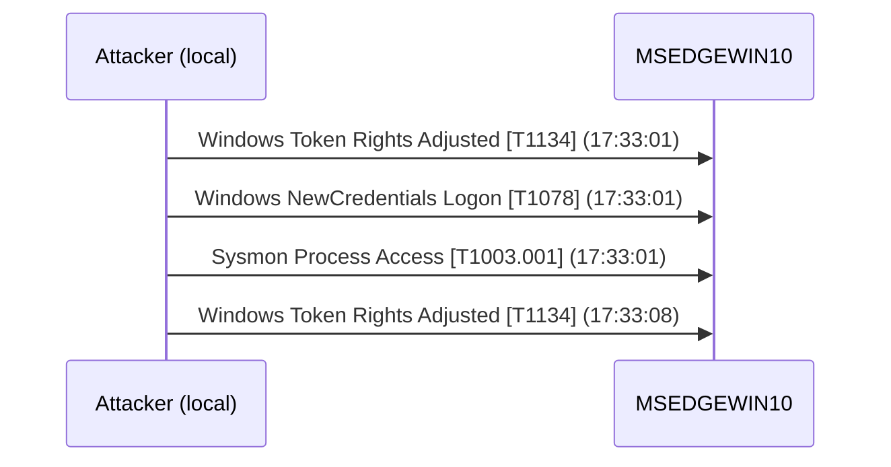

# Sample Report

Real output from `ais analyze` run against a captured Windows Sysmon + Security Event Log from
[sbousseaden/EVTX-ATTACK-SAMPLES](https://github.com/sbousseaden/EVTX-ATTACK-SAMPLES).
The log captures a **MalSecLogon credential dump** — the attacker abuses `CreateProcessWithLogonW`
(LogonType 9) to spawn a process with impersonated credentials, then directly reads LSASS memory
via `OpenProcess(PROCESS_VM_READ)` to dump credential hashes.

This sample exercises **three detection pathways simultaneously**:

| Chain | Detection pass | Why it fired |
|---|---|---|
| `credential_access` | Pass 5 — LSASS sweep | Sysmon EID 10 with PROCESS_VM_READ on lsass.exe |
| `unauthorized_access` | Pass 4 — high-value sweep | LogonType 9 → `Windows NewCredentials Logon` (token impersonation) |
| `lateral_movement` | Pass 4 — high-value sweep | `Windows Token Rights Adjusted` — T1134 |

Note that **zero failed logins appear** anywhere in this log. All three chains were detected
entirely through behavioural telemetry with no IP attribution — this attack would be completely
invisible to any threshold-based brute-force detector.

```bash
ais analyze tutto_malseclogon.evtx --fmt evtx --output incident.md
```

---

# Cyber Incident Report

*Generated: 2026-04-26 13:39 UTC*

## Executive Summary (BLUF)

Analysis of **13** log events identified **3 attack chain(s)**.
**3 attacker(s) achieved successful authentication**, potentially compromising account(s): `IEUser`, `MSEDGEWIN10$`, `MSEDGEWIN10\IEUser`.
Maximum incident severity: **CRITICAL**.

## Attack Timeline

| UTC Time | Attacker IP | User | Event | MITRE | Severity |
|----------|-------------|------|-------|-------|----------|
| 17:33:01 | — | `IEUser` | Windows Token Rights Adjusted | `T1134` Access Token Manipulation | low |
| 17:33:01 | — | `IEUser` | Windows NewCredentials Logon | `T1078` Valid Accounts | high |
| 17:33:01 | — | `MSEDGEWIN10\IEUser` | Sysmon Process Access | `T1003.001` OS Credential Dumping: LSASS Memory | critical |
| 17:33:08 | — | `MSEDGEWIN10$` | Windows Token Rights Adjusted | `T1134` Access Token Manipulation | low |

## Visual Sequence Map



## Threat Actor Detail

### Chain 1 — `CRITICAL` · Credential Access
- **Chain type**: Credential Access
- **Compromised**: Yes [!]
- **Primary target account**: `MSEDGEWIN10\IEUser`
- **Attack progression**: `T1003.001`
- **Detection**: Pass 5 — Sysmon EID 10 (LSASS PROCESS_VM_READ)
- **Events in chain**: 1
- **Active window**: 17:33:01 → 17:33:01

### Chain 2 — `HIGH` · Unauthorized Access
- **Chain type**: Unauthorized Access
- **Compromised**: Yes [!]
- **Primary target account**: `IEUser`
- **Attack progression**: `T1134` → `T1078`
- **Detection**: Pass 4 — LogonType 9 (`Windows NewCredentials Logon`) is inherently suspicious
- **Events in chain**: 2
- **Active window**: 17:33:01 → 17:33:01

### Chain 3 — `LOW` · Lateral Movement
- **Chain type**: Lateral Movement
- **Compromised**: Yes [!]
- **Primary target account**: `MSEDGEWIN10$`
- **Attack progression**: `T1134`
- **Detection**: Pass 4 — `Windows Token Rights Adjusted` (machine account)
- **Events in chain**: 1
- **Active window**: 17:33:08 → 17:33:08

## Recommendations

1. **Contain immediately** — isolate `MSEDGEWIN10` from the network; assume all local credentials are compromised.
2. **Rotate all credentials** on the host: `IEUser`, `MSEDGEWIN10$` machine account, and any accounts whose hashes were in LSASS at the time.
3. **Investigate LogonType 9 usage** — `CreateProcessWithLogonW` is rarely used by legitimate software; review the parent process and spawned child to identify the impersonation source.
4. **Enable Credential Guard** on Windows 10/11 endpoints to prevent LSASS memory reads even from high-privileged processes.
5. **Audit token-manipulation events (4703/4672)** — repeated `Windows Token Rights Adjusted` from a non-SYSTEM process is a strong indicator of privilege-escalation tooling.
6. **Deploy Sysmon** with a configuration that audits EID 10 (process access) if not already present; this attack is invisible without endpoint telemetry.

## Forensic Integrity

| Source Log | Events Analyzed |
|-----------|----------------|
| `tutto_malseclogon.evtx` | 13 |

> Original log files are opened read-only and never modified. SHA-256 hashes are stored in `data/processed/` for chain-of-custody verification.
